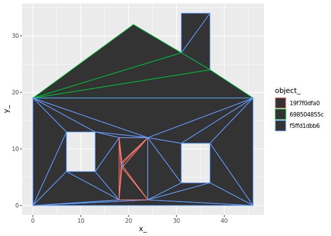

<!-- README.md is generated from README.Rmd. Please edit that file -->
pfft
====

The goal of pfft is to provide a straightforward mapping between triangles and the objects they belong to.

Installation
------------

You can install pfft from github with:

``` r
# install.packages("devtools")
devtools::install_github("mdsumner/pfft")
```

Example
-------

This is a basic example which shows you how to solve a common problem:

``` r
## basic example code
```

Rationale
=========

At the moment this is just an exploratory test-bed for anglr.

Polygon finder for triangles

This workflow came from anglr, the current scheme is to triangulate set-wide, on the entire layer and then find out which polygon each triangle belongs to. This is because polygons that wrap around a void but only touch at a single vertex end up with that void being kept as only the regions inside holes was being removed.

If we do it set-wide we can't check each feature individually (a feature might be inside a hole of another feature), and we can't sensibly normalize triangles that fall into overlapping features.

Together this gives the best of all (that's the theory, today!) and solves a bunch of lingering problems that anglr has.

If we provide a native point-in-polygon routine here then we can abandon dependencies that bring in other unused libs.

This also means we can use z-fighting, easily visible with rgl, to indicate when we have overlapping features - and also ilustrate how we need to de-normalize for discrete features in 3D, etc. etc.

``` r
library(raster)
#> Loading required package: sp
library(spex)
library(sf)
#> Linking to GEOS 3.5.1, GDAL 2.2.3, proj.4 4.9.3
library(dplyr)
#> 
#> Attaching package: 'dplyr'
#> The following objects are masked from 'package:raster':
#> 
#>     intersect, select, union
#> The following objects are masked from 'package:stats':
#> 
#>     filter, lag
#> The following objects are masked from 'package:base':
#> 
#>     intersect, setdiff, setequal, union
library(pfft)
library(rgl)
data("holey", package = "spbabel")
x <- st_as_sf(spbabel::sp(holey))
#library(sf)
#x <- read_sf(system.file("shape/nc.shp", package="sf"))
#data("minimal_mesh", package = "silicate")
#x <- minimal_mesh
max_area <- NULL
p <- silicate::PATH(x)  
RTri <- edge_RTriangle(p)
ptm <- path_triangle_map(p, RTri)

## unique triangles
triangle <- tibble::tibble(triangle_ = silicate::sc_uid(nrow(RTri$T)))
## all triangle instances
ptm[["triangle_"]] <- triangle[["triangle_"]][ptm[["triangle_idx"]]]
ptm[["triangle_idx"]] <- NULL
## any triangle that occurs an even number of times in a path per object is part of a hole
ptm <- dplyr::inner_join(ptm, p[["path"]][c("path_", "object_")])
#> Joining, by = "path_"
ptm <- ptm %>% group_by(object_,triangle_) %>% mutate(n = n()) %>% ungroup()  #%>% 

tt <- dplyr::select(ptm, object_, triangle_) %>% 
  anti_join(ptm %>% filter(n %% 2 == 0) %>% dplyr::select(object_, triangle_))
#> Joining, by = c("object_", "triangle_")
#if (length(remove_idx) > 0) TT <- RTri$T[-remove_idx, ] else TT <- RTri$T
tXv <- tibble::tibble(vertex_ = p[["vertex"]][["vertex_"]][t(RTri$T)], 
                      triangle_ = rep(triangle[["triangle_"]], each = 3))

v <- p[["vertex"]]
outlist <- list(o = p$o, t = tt, tXv = tXv, v = v)
 class(outlist) <- "trimesh"

 
 library(ggplot2)
#> 
#> Attaching package: 'ggplot2'
#> The following object is masked from 'package:spex':
#> 
#>     ylim
#> The following object is masked from 'package:raster':
#> 
#>     calc
 library(dplyr)
gg <- ggplot(purrr::reduce(outlist[c("tXv", "v", "t", "o")], inner_join))
#> Joining, by = "vertex_"
#> Joining, by = "triangle_"
#> Joining, by = "object_"

gg + geom_polygon(aes(x_, y_, group = triangle_, fill = triangle_)) + facet_wrap(~object_, nr = 2)
```


``` r


gg + geom_polygon(aes(x_, y_, group = triangle_, colour = object_))
```



``` r


library(anglr)
rgl::rgl.clear()
plot(outlist)
#> Joining, by = "triangle_"
#> Joining, by = "object_"
rgl::rglwidget()
```


``` r
# gibble_pip <- function(pts, gm, coords) {
#   object_id <- rep(seq_len(nrow(gm)), gm[["nrow"]])
#   tibble::tibble(ipoly = sp::over(SpatialPoints(as.matrix(pts)), 
#                                   sp::SpatialPolygons(purrr::imap(split(coords, object_id), 
#                                                                   ~ sp::Polygons(list(sp::Polygon(as.matrix(.x))), .y)))
#   ))
# }
```

Dev
===

``` r

tools::package_native_routine_registration_skeleton("../pfft", "src/init.c",character_only = FALSE)
```
