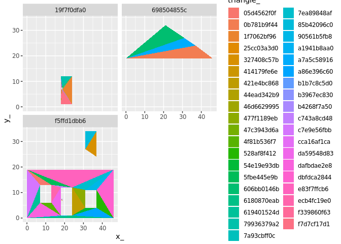

<!-- README.md is generated from README.Rmd. Please edit that file -->
pfft
====

The goal of pfft is to ...

Installation
------------

You can install pfft from github with:

``` r
# install.packages("devtools")
devtools::install_github("mdsumner/pfft")
```

Example
-------

This is a basic example which shows you how to solve a common problem:

``` r
## basic example code
```

Polygon finder for triangles

This workflow came from anglr, the current scheme is to triangulate set-wide, on the entire layer and then find out which polygon each triangle belongs to. This is because polygons that wrap around a void but only touch at a single vertex end up with that void being kept as only the regions inside holes was being removed.

If we do it set-wide we can't check each feature individually (a feature might be inside a hole of another feature), and we can't sensibly normalize triangles that fall into overlapping features.

Together this gives the best of all (that's the theory, today!) and solves a bunch of lingering problems that anglr has.

If we provide a native point-in-polygon routine here then we can abandon dependencies that bring in other unused libs.

This looks good, though maybe geometry or ptinpoly or something like that:

<https://stackoverflow.com/a/36684485/355270>

This also means we can use z-fighting, easily visible with rgl, to indicate when we have overlapping features - and also ilustrate how we need to de-normalize for discrete features in 3D, etc. etc.

``` r
library(raster)
#> Loading required package: sp
library(spex)
library(sf)
#> Linking to GEOS 3.5.1, GDAL 2.2.2, proj.4 4.9.3
library(dplyr)
#> 
#> Attaching package: 'dplyr'
#> The following objects are masked from 'package:raster':
#> 
#>     intersect, select, union
#> The following objects are masked from 'package:stats':
#> 
#>     filter, lag
#> The following objects are masked from 'package:base':
#> 
#>     intersect, setdiff, setequal, union
library(pfft)
library(rgl)
#> Warning in rgl.init(initValue, onlyNULL): RGL: unable to open X11 display
#> Warning: 'rgl_init' failed, running with rgl.useNULL = TRUE
data("holey", package = "spbabel")
#x <- st_as_sf(spbabel::sp(holey))
library(sf)
example(st_read)
#> 
#> st_red> nc = st_read(system.file("shape/nc.shp", package="sf"))
#> Reading layer `nc' from data source `/usr/local/lib/R/site-library/sf/shape/nc.shp' using driver `ESRI Shapefile'
#> Simple feature collection with 100 features and 14 fields
#> geometry type:  MULTIPOLYGON
#> dimension:      XY
#> bbox:           xmin: -84.32385 ymin: 33.88199 xmax: -75.45698 ymax: 36.58965
#> epsg (SRID):    4267
#> proj4string:    +proj=longlat +datum=NAD27 +no_defs
#> 
#> st_red> summary(nc) # note that AREA was computed using Euclidian area on lon/lat degrees
#>       AREA          PERIMETER         CNTY_         CNTY_ID    
#>  Min.   :0.0420   Min.   :0.999   Min.   :1825   Min.   :1825  
#>  1st Qu.:0.0910   1st Qu.:1.324   1st Qu.:1902   1st Qu.:1902  
#>  Median :0.1205   Median :1.609   Median :1982   Median :1982  
#>  Mean   :0.1263   Mean   :1.673   Mean   :1986   Mean   :1986  
#>  3rd Qu.:0.1542   3rd Qu.:1.859   3rd Qu.:2067   3rd Qu.:2067  
#>  Max.   :0.2410   Max.   :3.640   Max.   :2241   Max.   :2241  
#>                                                                
#>         NAME         FIPS        FIPSNO         CRESS_ID     
#>  Alamance : 1   37001  : 1   Min.   :37001   Min.   :  1.00  
#>  Alexander: 1   37003  : 1   1st Qu.:37050   1st Qu.: 25.75  
#>  Alleghany: 1   37005  : 1   Median :37100   Median : 50.50  
#>  Anson    : 1   37007  : 1   Mean   :37100   Mean   : 50.50  
#>  Ashe     : 1   37009  : 1   3rd Qu.:37150   3rd Qu.: 75.25  
#>  Avery    : 1   37011  : 1   Max.   :37199   Max.   :100.00  
#>  (Other)  :94   (Other):94                                   
#>      BIR74           SID74          NWBIR74           BIR79      
#>  Min.   :  248   Min.   : 0.00   Min.   :   1.0   Min.   :  319  
#>  1st Qu.: 1077   1st Qu.: 2.00   1st Qu.: 190.0   1st Qu.: 1336  
#>  Median : 2180   Median : 4.00   Median : 697.5   Median : 2636  
#>  Mean   : 3300   Mean   : 6.67   Mean   :1050.8   Mean   : 4224  
#>  3rd Qu.: 3936   3rd Qu.: 8.25   3rd Qu.:1168.5   3rd Qu.: 4889  
#>  Max.   :21588   Max.   :44.00   Max.   :8027.0   Max.   :30757  
#>                                                                  
#>      SID79          NWBIR79                 geometry  
#>  Min.   : 0.00   Min.   :    3.0   MULTIPOLYGON :100  
#>  1st Qu.: 2.00   1st Qu.:  250.5   epsg:4267    :  0  
#>  Median : 5.00   Median :  874.5   +proj=long...:  0  
#>  Mean   : 8.36   Mean   : 1352.8                      
#>  3rd Qu.:10.25   3rd Qu.: 1406.8                      
#>  Max.   :57.00   Max.   :11631.0                      
#>                                                       
#> 
#> st_red> ## Not run: 
#> st_red> ##D   library(sp)
#> st_red> ##D   example(meuse, ask = FALSE, echo = FALSE)
#> st_red> ##D   try(st_write(st_as_sf(meuse), "PG:dbname=postgis", "meuse",
#> st_red> ##D        layer_options = "OVERWRITE=true"))
#> st_red> ##D   try(st_meuse <- st_read("PG:dbname=postgis", "meuse"))
#> st_red> ##D   if (exists("st_meuse"))
#> st_red> ##D     summary(st_meuse)
#> st_red> ## End(Not run)
#> st_red> # read geojson from string:
#> st_red> geojson_txt <- paste("{\"type\":\"MultiPoint\",\"coordinates\":",
#> st_red+    "[[3.2,4],[3,4.6],[3.8,4.4],[3.5,3.8],[3.4,3.6],[3.9,4.5]]}")
#> 
#> st_red> x = read_sf(geojson_txt)
#> 
#> st_red> x
#> Simple feature collection with 1 feature and 0 fields
#> geometry type:  MULTIPOINT
#> dimension:      XY
#> bbox:           xmin: 3 ymin: 3.6 xmax: 3.9 ymax: 4.6
#> epsg (SRID):    4326
#> proj4string:    +proj=longlat +datum=WGS84 +no_defs
#>                         geometry
#> 1 MULTIPOINT (3.2 4, 3 4.6, 3...
#> 
#> st_red> ## Not run: 
#> st_red> ##D library(RPostgreSQL)
#> st_red> ##D try(conn <- dbConnect(PostgreSQL(), dbname = "postgis"))
#> st_red> ##D if (exists("conn") && !inherits(conn, "try-error")) {
#> st_red> ##D   x = st_read_db(conn, "meuse", query = "select * from meuse limit 3;")
#> st_red> ##D   x = st_read_db(conn, table = "public.meuse")
#> st_red> ##D   print(st_crs(x)) # SRID resolved by the database, not by GDAL!
#> st_red> ##D   dbDisconnect(conn)
#> st_red> ##D  }
#> st_red> ## End(Not run)
#> st_red> 
#> st_red> 
#> st_red>
x <- nc
#data("minimal_mesh", package = "silicate")
#x <- minimal_mesh
max_area <- NULL
p <- silicate::PATH(x)  
RTri <- edge_RTriangle(p)
ptm <- path_triangle_map(p, RTri)


triangle <- tibble::tibble(triangle_ = silicate::sc_uid(nrow(RTri$T)), triangle_idx = 1:nrow(RTri$T))
ptm[["triangle_"]] <- triangle[["triangle_"]][ptm[["triangle_idx"]]]
ptm <- dplyr::inner_join(ptm, p[["path"]][c("path_", "object_", "subobject")])
#> Joining, by = "path_"
ptm <- ptm %>% group_by(object_,  subobject, triangle_idx) %>% mutate(n = n()) %>% ungroup()  %>% dplyr::filter(n < 2)


o <- p[["object"]]
t <- ptm %>% #ptm %>% dplyr::inner_join(p$path %>% dplyr::select(object_, path_)) %>% 
  dplyr::select(object_, triangle_)
remove_idx <-  setdiff(1:nrow(RTri$T), ptm$triangle_idx)
ptm <- ptm %>% dplyr::arrange(triangle_idx)
if (length(remove_idx) > 0) TT <- RTri$T[-remove_idx, ] else TT <- RTri$T
tXv <- tibble::tibble(vertex_ = p[["vertex"]][["vertex_"]][t(TT)], 
                      triangle_ = rep(ptm[["triangle_"]], each = 3))

v <- p[["vertex"]]
outlist <- list(o = o, t = t, tXv = tXv, v = v)
 class(outlist) <- "trimesh"
  
library(anglr)
rgl::rgl.clear()
plot(outlist)
#> Joining, by = "triangle_"
#> Joining, by = "object_"
rgl::rglwidget()
```



``` r
# gibble_pip <- function(pts, gm, coords) {
#   object_id <- rep(seq_len(nrow(gm)), gm[["nrow"]])
#   tibble::tibble(ipoly = sp::over(SpatialPoints(as.matrix(pts)), 
#                                   sp::SpatialPolygons(purrr::imap(split(coords, object_id), 
#                                                                   ~ sp::Polygons(list(sp::Polygon(as.matrix(.x))), .y)))
#   ))
# }
```

Dev
===

``` r

tools::package_native_routine_registration_skeleton("../pfft", "src/init.c",character_only = FALSE)
```
